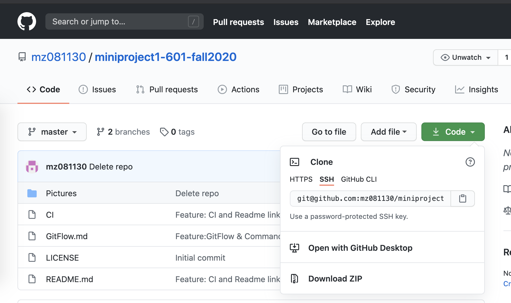
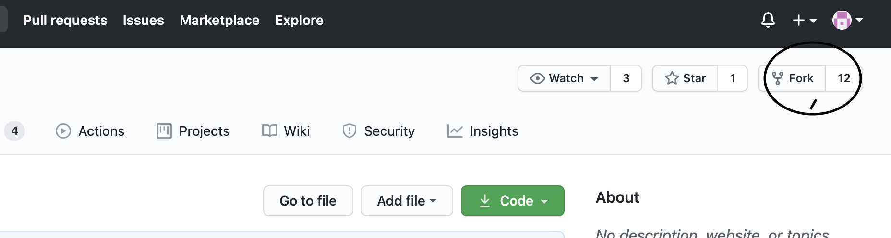

# GitFlow

  

## What is Git and GiFlow

Git is widely used, open source system which provides performance, security, Flexibility and Distributed Version control to developers worldwide.
Gitflow Workflow is a Git workflow design that was first published and made popular by Vincent Driessen at nvie. The Gitflow Workflow defines a strict branching model designed around the project release. This provides a robust framework for managing larger projects

## What is Version Control System (VCS)?
Version control system is a system that records changes to a file or set of files over time so that you can recall specific versions later by using git command or various git tools available online. Suppose you are a developer and want to keep every version of code or after some particular tasks completion a Version Control System (VCS) is very useful tool. It allows you to revert files back to a previous state, compare changes over time, it allow you to take the other developer code changes using git command, see who modified the files over the time, who has done more number of lines of code, various type of statistics on the repository, who has done the code with bug and when, and many more, basically you can entirely do the tracking of the files over the time and go back to any previous changes.

  

# Git Commands & Terminology

  
### Repository

Repository is a collection of files of various different versions of a project saved in a version control system, e.g., Github.

Usage; Repo on github can be created by creating and account on [github](http://https://github.com/).

  

### Clone
This commands make a copy of an existing repo on to the local directory. cloning can be done using HTTP or SSH.
    
    git clone <clonePath>

  

### Fork
Forking an official repo allows a developer to save the copy on their personal public repo and no other developers are allowed to push to it, but only the repo owner can pull changes from it
Forking a repo on Github can be done on the upper right corner, simply click **Fork**.

### Branch
Branches are individual projects within a repository. Different branches within a repository can have completely different files and folders, or it could have everything the same except for some lines of code in a file.
Usage: 
Command to find current branch you are in:
    
    git branch	
   
To create a new branch

    git branch <branchname>   
  

### Commit
Git commit is used when we want to save changes to our local files/folder and push the changes to the remote server.
Usage:
 
    git add <branchname>
    git commit -m 'write your comments here'

### Merge
This command combines two branches together. This can be done via github web interface or by using terminal
Usage:

    git checkout master 
    git merge <branchname>

### Checkout
The git checkout command lets you navigate between the branches created by git branch . Checking out a branch updates the files in the working directory to match the version stored in that branch, and it tells Git to record all new commits on that branch.	
    git branch 
    git checkout <branch>
    
### Push
The git push command is used to upload local repository content to a remote repository. Pushing is how you transfer commits from your local repository to a remote repo. It's the counterpart to git fetch , but whereas fetching imports commits to local branches, pushing exports commits to remote branches.

     git push origin master  
     git push origin <branchname> (Push the branch to your remote repository, so others can use it)
     git push --all origin           (Push all branches to your remote repository:)
     git push origin :<branchname>  (elete a branch on your remote repository:)
     git push --tags origin (Push all tags to remote repository:)
### Pull
The git pull command is used to fetch and download content from a remote repository and immediately update the local repository to match that content. Merging remote upstream changes into your local repository is a common task in Git-based collaboration work flows.
    
     git pull [<options>] [<repository> [<refspec>]

### Remote add
The git remote add command will create a new connection record to a remote repository. After adding a remote, you'll be able to use as a convenient shortcut for in other Git commands. For more information on the accepted URL syntax, view the "Repository URLs" section below.

     git remote add origin <server> (If you haven't connected your local repository to a remote server, add the server to be able to push to it:)
     git remote -v (List all currently configured remote repositories:)
### Remote
git rm is used to remove a file from a Git repository. It is a convenience method that combines the effect of the default shell rm command with git add . This means that it will first remove a target from the filesystem and then add that removal event to the staging index

     git rm [-f | --force] [-n] [-r] [--cached] [--ignore-unmatch]
	  [--quiet] [--pathspec-from-file=<file> [--pathspec-file-nul]]
	  [--] [<pathspec>]

### Show
git-show is a command line utility that is used to view expanded details on Git objects such as blobs, trees, tags, and commits. git-show has specific behavior per object type. Tags show the tag message and other objects included in the tag. Trees show the names and content of objects in a tree
 
     git show [<options>] [<object>]

### Status
The git status command displays the state of the working directory and the staging area. It lets you see which changes have been staged, which haven't, and which files aren't being tracked by Git. Status output does not show you any information regarding the committed project history.

     git status [<options>] [--] [<pathspec>]

### Master Branch      
The default branch name in Git is master . As you start making commits, you're given a master branch that points to the last commit you made. Every time you commit, the master branch pointer moves forward automatically. The “master” branch in Git is not a special branch.

  
Source:[BitBucket](https://www.atlassian.com/git/tutorials/what-is-git),[Medium](https://medium.com/@okandavut/what-is-gitflow-c0be7a659992)
